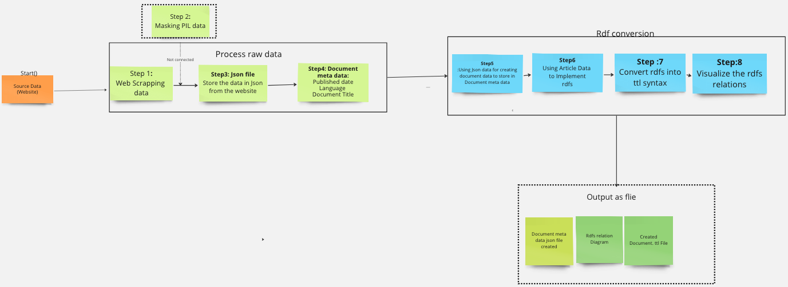

# Legal Text Data - Machine Readable

This project aims to execute legal documents, extracting valuable metadata, revealing underlying structure, and machine understandable.

## 🚀 Getting Started

Follow these instructions to get the project up and running on your local machine, be it for development or testing.

### 📋 Prerequisites

Ensure you've got the following tools and environments set up:

- **Python 3.x**
- **pip**
- **virtualenv** (highly recommended)

### 🔧 Installation & Execution

1. **Clone the repository**:

   ```bash
   git clone https://github.com/pgupta119/legal-data-machine-readable.git
   ```

2. **Set up and activate your virtual environment**:

   ```bash
   virtualenv venv
   source venv/bin/activate
   ```

3. **Install necessary packages**:

   ```bash
   pip install -r requirements.txt
   ```

4. **Execute the main script**:

   ```bash
   python main.py
   ```

   - **Output:** Files will be saved to the `data/processed/json_document_after_parsing` directory.
   - **Generated Files:** Look for `document_metadata.json`, `document.ttl`, and `document_kg.png` in the `data/output` directory.

A visual representation of the workflow:

---

## 🚶‍♂️ Step-by-Step Workflow
Refer to the diagram below for a visual representation of the workflow:


---

**Further Reading**: For a deeper dive into the project, consult the [detailed documentation](https://docs.google.com/document/d/1SisgQlyt_FivgtzCQ4DyQ-SOl8EQtd6ZjQVhxu-rxeM/edit?usp=sharing).

## 🛠️ Built With

- **Beautiful Soup**: Powering web scraping.
- **RDFLib**: Handling RDF conversion.
